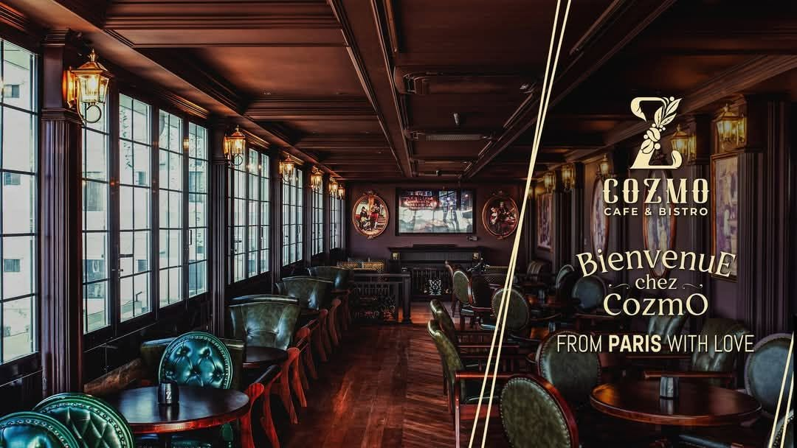

# Cozmo Cafe & Bistro ☕✨

A premium, modern, and high-performance website for **Cozmo Cafe & Bistro** — European & French-inspired dining located at Rupayan Shopping Square, Basundhara R/A, Dhaka.



---

## 🌟 Features

- **European & French Aesthetic:** Tailored dark mocha, warm amber, and antique gold palette honoring medieval British & Parisian cafe culture.
- **Dynamic 69-Item Lite Bite Menu:**
  - 13 distinct categories (Appetizers, Tapas, Momos, Burgers, Tacos, Pide, Pasta, Pizza, etc.)
  - Real-time instant search and category filter pills
  - Decoupled `menu.json` architecture for zero-code content management
- **Direct WhatsApp Table Reservation:** Native, zero-backend reservation system sending pre-formatted reservation details directly to Cozmo's booking hotline (`+880 1819-339966`).
- **Ambiance Gallery:** Showcases signature indoor fireplace, life-sized thematic Renaissance paintings, and cozy dining nooks.
- **Smooth Navigation & UX:** Sticky header with offset management, fully responsive mobile navigation, and error-resilient asset loading.

---

## 📍 Essential Info

- **Address:** 2 Sayem Sobhan Anvir Rd, Rupayan Shopping Square (2nd Floor), Basundhara R/A, Dhaka 1229, Bangladesh
- **Reservations & Hotline:** `+880 1819-339966`
- **Official Facebook:** [facebook.com/cozmocafenbistro](https://www.facebook.com/cozmocafenbistro/)
- **Pricing:** 5% VAT Exclusive on all menu items

---

## 🚀 Getting Started

No build tools or heavy Node VPS required. Simply open with any static server or browser:

```bash
# Option 1: Python static server
python -m http.server 8080

# Option 2: Node npx serve
npx serve .
```

Visit `http://localhost:8080` in your browser.

---

## 📁 Project Structure

```
├── app.js               # Frontend controller (menu rendering, filter/search, WhatsApp booking)
├── style.css            # Custom CSS3 styles, layout grid, and responsive rules
├── index.html           # Semantic HTML5 single-page structure
├── menu.json            # Structured dataset with 69 dishes and pricing
├── cozmo_cafe_info.md   # Official guide, ambiance highlights, and raw menu reference
└── cozmo_resources/     # Official branding assets (logo, cover, interior photos)
    ├── cozmo_logo.jpg
    ├── cozmo_cover.jpg
    └── cozmo_1.jpg - cozmo_7.jpg
```

---

## 📜 License

Created for Cozmo Cafe & Bistro. All rights reserved.
